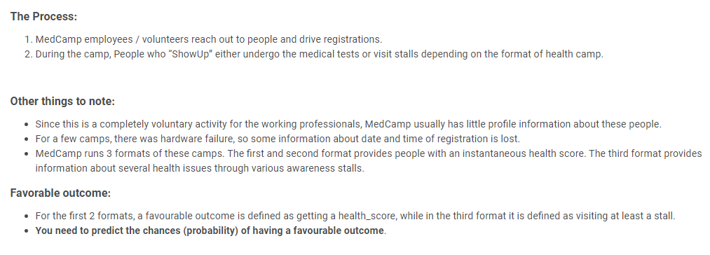
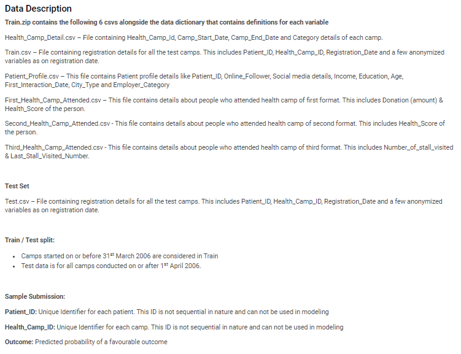
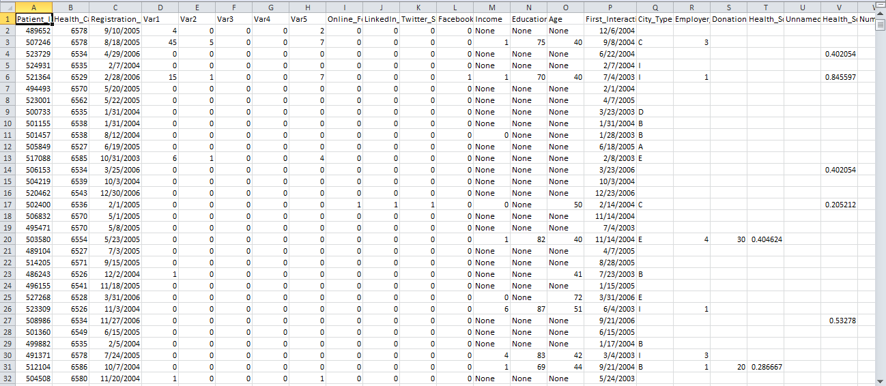
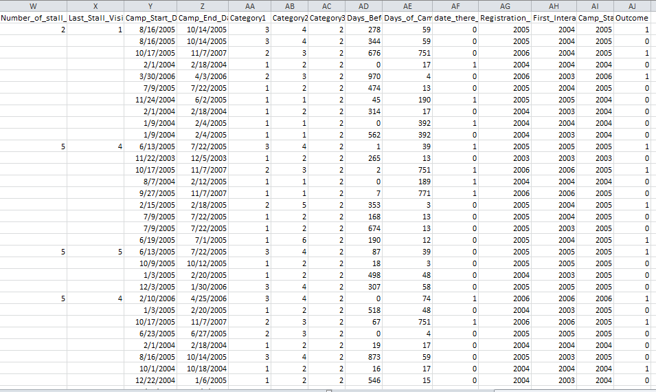

# Janatahack-Healthcare-Analytics
Rank 10 Public LB Solution for Hackathon:
## Problem Statement

## Data Description at a Glance:

## Data after Merging everything:

## Description of Approach/Feature Engineering:
1. Created Date related features/ also Date difference features which shows how active the patient is
2. Created Frequency related features
3. Created category_category combine features
## Tools used
1. Python for programming
2. pandas and numpy libraries for methodology
3. sklearn's logistic regression and lightgbm library for the model
4. matplotlib and seaborn was used for plotting and analyzing the data
## Credits:
Seems like this hackathon is repeated after 4 years... and there are many solutions on them, I referred few. \
Hackathon: [Knocktober 2016](https://datahack.analyticsvidhya.com/contest/knocktober-2016/)
## Competition Result
Rank: 10th on public LB and _ on private LB\
[LinktoLB](https://datahack.analyticsvidhya.com/contest/janatahack-healthcare-analytics/#LeaderBoard)
